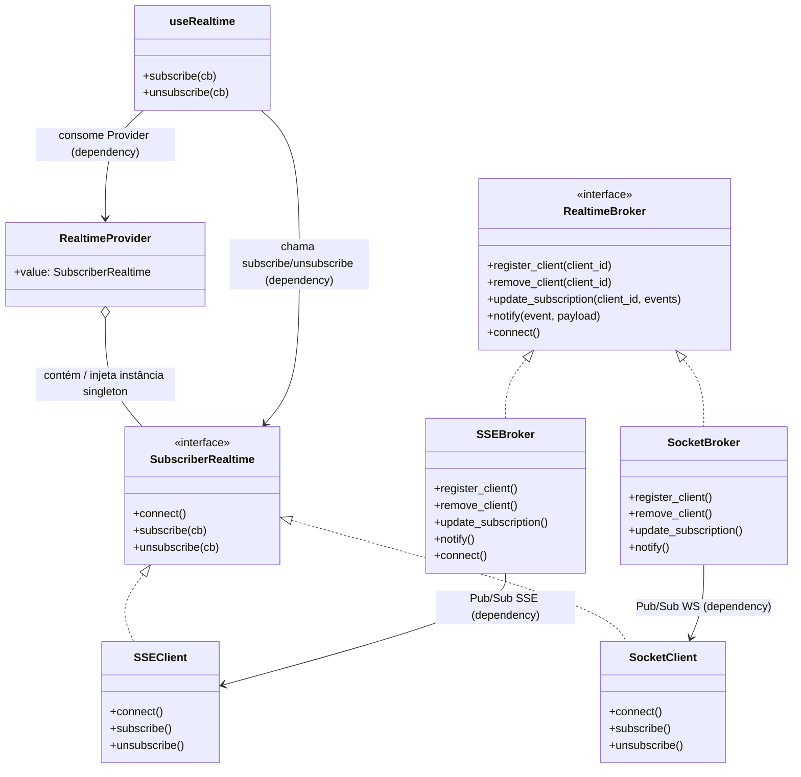

# Guia de Desenvolvimento

## 📁 Estrutura do Projeto  

**Estrutura Documentada:**

```plaintext
SimuladorFinanceiro/
├── .github/                            # Configurações do GitHub (Actions, workflows, etc)
│   └── workflows/                      # Workflows de CI/CD e automações
├── .vscode/                            # Configurações do Visual Studio Code para o projeto
├── backend/                            # Código-fonte do servidor Python (FastAPI)
│   ├── config/                         # Configurações da aplicação (variáveis de ambiente, TOML)
│   ├── core/                           # Infraestrutura central (database, logger, models, utils)
│   │   ├── decorators/                 # Decoradores reutilizáveis (auth, cache, etc)
│   │   ├── dependencies/               # Dependências do FastAPI (injeção de dependência)
│   │   ├── dto/                        # Data Transfer Objects para comunicação backend->frontend e tipagem forte
│   │   │   └── events/                 # DTOs específicos para eventos da simulação
│   │   ├── enum/                       # Enumerações globais (tipos, status, etc)
│   │   ├── exceptions/                 # Exceções customizadas da aplicação
│   │   ├── models/                     # Modelos SQLAlchemy (entidades do banco de dados)
│   │   ├── repository/                 # Camada de acesso a dados (Data Access Layer)
│   │   ├── runtime/                    # Gerenciadores runtime singleton thread-safe (brokers, túneis, etc)
│   │   └── utils/                      # Funções utilitárias genéricas de infraestrutura
│   ├── features/                       # Funcionalidades organizadas por domínio (DDD)
│   │   ├── fixed_income/               # Lógica de negócio de Renda Fixa
│   │   │   ├── entities/               # Entidades de domínio (CDB, Tesouro, etc)
│   │   │   └── factory/                # Factories para criação de ativos de RF
│   │   ├── import_data/                # Serviço de importação de dados externos
│   │   ├── realtime/                   # Sistema de comunicação em tempo real (WebSocket/SSE)
│   │   ├── simulation/                 # Engine de simulação do mercado financeiro
│   │   ├── strategy/                   # Algoritmos de estratégias de investimento
│   │   ├── tunnel/                     # Sistema de túnel para multiplayer (ngrok, etc)
│   │   │   ├── network_utils/          # Utilitários de rede para túneis
│   │   │   └── providers/              # Provedores de túnel (ngrok, localtunnel)
│   │   └── variable_income/            # Lógica de negócio de Renda Variável
│   │       ├── entities/               # Entidades de domínio (Ações, FIIs, etc)
│   │       └── liquidity/              # Sistema de liquidez e book de ofertas
│   ├── routes/                         # Endpoints REST da API (routers do FastAPI)
│   └── types/                          # Definições de tipos Python compartilhados
├── docs/                               # Documentação do projeto (Docusaurus)
├── frontend/                           # Aplicação React + TypeScript (Vite)
│   ├── assets/                         # Assets estáticos do frontend (imagens, fontes)
│   ├── features/                       # Funcionalidades organizadas por domínio (Feature-Based)
│   │   ├── auth/                       # Feature de autenticação e login
│   │   │   └── pages/                  # Páginas de autenticação
│   │   ├── fixed-income/               # Feature de Renda Fixa
│   │   │   ├── components/             # Componentes específicos de RF
│   │   │   ├── models/                 # Models de ativos de RF
│   │   │   ├── pages/                  # Páginas da feature de RF
│   │   │   └── schemas/                # Schemas de validação (Zod) para RF
│   │   ├── import-assets/              # Feature de importação de ativos
│   │   │   ├── components/             # Componentes de importação (CSV, YFinance)
│   │   │   └── pages/                  # Páginas de importação
│   │   ├── lobby/                      # Feature de lobby/sessões multiplayer
│   │   │   ├── components/             # Componentes do lobby
│   │   │   ├── hooks/                  # Hooks customizados do lobby
│   │   │   └── pages/                  # Páginas do lobby
│   │   ├── portfolio/                  # Feature de carteira/portfólio
│   │   │   ├── components/             # Componentes da carteira (gráficos, tabelas)
│   │   │   ├── lib/                    # Lógica de negócio da carteira
│   │   │   └── pages/                  # Páginas da carteira
│   │   ├── settings/                   # Feature de configurações
│   │   │   ├── components/             # Componentes de configurações
│   │   │   └── pages/                  # Páginas de configurações
│   │   ├── statistics/                 # Feature de estatísticas e ranking
│   │   │   ├── components/             # Componentes de estatísticas
│   │   │   ├── lib/                    # Lógica de cálculo de estatísticas
│   │   │   └── pages/                  # Páginas de estatísticas
│   │   ├── strategies/                 # Feature de estratégias automatizadas
│   │   │   └── pages/                  # Páginas de estratégias
│   │   └── variable-income/            # Feature de Renda Variável
│   │       ├── components/             # Componentes de RV (gráficos, ordens)
│   │       └── pages/                  # Páginas de RV (mercado, detalhes)
│   ├── layouts/                        # Layouts principais da aplicação
│   │   └── partial/                    # Componentes parciais de layout (sidebar, topbar)
│   ├── pages/                          # Páginas genéricas (erro, loading, etc)
│   ├── public/                         # Assets públicos servidos pelo Vite
│   ├── shared/                         # Código compartilhado entre features
│   │   ├── components/                 # Componentes React reutilizáveis entre as features
│   │   ├── context/                    # Contexts globais (React Context API)
│   │   │   ├── auth/                   # Context de autenticação
│   │   │   ├── notifications-settings/ # Context de configurações de notificações
│   │   │   ├── page-label/             # Context de labels de páginas
│   │   │   ├── realtime/               # Context de comunicação em tempo real
│   │   │   └── simulation/             # Context de estado da simulação
│   │   ├── hooks/                      # Hooks customizados reutilizáveis
│   │   ├── lib/                        # Bibliotecas internas e utilitários
│   │   │   ├── models/                 # Classes e models (ApiError, etc)
│   │   │   ├── realtime/               # Cliente de WebSocket/SSE
│   │   │   ├── schemas/                # Schemas de validação (Zod)
│   │   │   └── utils/                  # Funções utilitárias (formatação, API, etc)
│   │   └── notifications/              # Sistema global de notificações
│   └── types/                          # Definições de tipos TypeScript compartilhados
└── scripts/                            # Scripts utilitários de desenvolvimento
```

A árvore da estrutura do projeto é mantido automaticamente com o script

```bash
python -X utf8 .\scripts\tree.py > arvore.md
```

As descrições exibidas ao lado dos arquivos e pastas na árvore são carregadas automaticamente do arquivo

```
scripts/tree_descriptions.yaml
```

Para adicionar ou alterar descrições, basta editar esse arquivo YAML, seguindo o padrão:

```yaml
backend/: Lógica do backend em Flask
data/: Arquivos de dados de entrada
```

Após salvar, execute novamente:

```bash
python -X utf8 .\scripts\tree.py > arvore.md
```

para gerar a estrutura atualizada com os comentários alinhados. 
Após isso copie o conteúdo para o arquivo `CONTRIBUTING.md` e exclua o arquivo `arvore.md`.

## 🔁 Ciclo de Desenvolvimento com Banco de Dados

1. ✏️ **Editar modelo no MySQL Workbench** (`.mwb`)
2. 📥 **Sincronizar o banco de dados MySQL**
3. 🧬 **Gerar ORM com sqlacodegen**  

```bash
   sqlacodegen postgresql+psycopg://postgres:<senha>@localhost:5432/simulador_financeiro > backend/core/models/models.py
```
4. 🛠️ **Compatibilizar com múltiplos bancos (MySQL/SQLite)**

O projeto detecta automaticamente qual banco usar (MySQL ou SQLite) com base nas variáveis de ambiente, e cria as tabelas automaticamente com:
```python
Base.metadata.create_all(bind=engine)
```

## 📖 Overview da Arquitetura Realtime

Esta seção documenta a arquitetura de comunicação realtime do SimuladorFinanceiro, usando **Pub/Sub** e mantendo consistência entre backend e frontend.

### Estrutura

* **Backend**

  * `RealtimeBroker` (interface)
  * `SSEBroker` / `SocketBroker` (implementações concretas)
  * Singleton do broker (`current_app.config["realtime_broker"]`)
  * Função `notify(event, payload)` para publicar eventos

* **Frontend**

  * `Subscriber` (interface comum)
  * `SSEClient` / `SocketClient` (implementações concretas)
  * `RealtimeProvider` (Provider do React)
  * `useRealtime()` (hook genérico)
  * Componentes consomem `useRealtime()` sem se importar com implementação concreta

---

### Diagrama UML em Mermaid



---

### Explicação

1. **Frontend**

   * O `Subscriber` define o contrato comum que qualquer implementação concreta (SSE ou WebSocket) deve seguir.
   * `RealtimeProvider` injeta **uma instância singleton** de `Subscriber` na árvore de componentes.
   * `useRealtime()` consome o Provider e gerencia subscribe/unsubscribe, atualizando `state` dos componentes.
   * Componentes (`Dashboard`, `Notifications`, etc.) usam `useRealtime()` sem conhecer se é SSE ou WS.

2. **Backend**

   * `RealtimeBroker` define a interface Pub/Sub para qualquer broker realtime.
   * `SSEBroker` implementa SSE, expondo `connect()` para streaming HTTP.
   * `SocketBroker` implementa WebSocket, sem `connect()` (conexão é gerenciada pelo SocketIO).
   * Singleton no Flask (`current_app.config["realtime_broker"]`) garante **uma única instância compartilhada** para todos os endpoints.

3. **Comunicação**

   * O frontend recebe eventos do backend via SSE ou WebSocket.
   * Backend publica eventos com `notify(event, payload)` para todos os subscribers registrados.
   * Frontend atualiza estado e re-renderiza componentes automaticamente.

---

💡 **Vantagens desta arquitetura**

* Coerência entre backend e frontend (interface comum + singleton + pub/sub).
* Flexível: troca de SSE por WebSocket ou mocks de teste apenas alterando o Provider.
* Seguro: TypeScript e Python garantem que as implementações concretas seguem os contratos.
* Reutilizável: múltiplos componentes podem usar o mesmo hook sem criar novas conexões.
* Evita memory leaks: subscribe/unsubscribe gerenciados pelo hook.

## ⚡ Diretrizes Async vs Sync

Este projeto **adota explicitamente um modelo híbrido (sync + async)**.  
O objetivo é **conter o código assíncrono na camada de transporte** e evitar que ele se propague para o core (domínio e engine).

### Convenções adotadas

- **Domínio e engine (síncrono):**  
  A lógica central da simulação — `backend/features/simulation/*`, `Simulation`, `SimulationEngine`, `UserManager` e a maior parte dos repositórios/DAO — **deve permanecer síncrona** (`def`).  
  Essas camadas executam cálculos, regras de negócio e acesso síncrono a dados, e podem rodar em threads dedicadas.

- **Loop da simulação (thread dedicada):**  
  A `SimulationLoopController` roda em uma `thread` separada e deve usar `time.sleep()` e mecanismos de sincronização de thread (`threading.Lock`).  
  **Não transforme o loop em coroutine**, pois isso forçaria a migração do core para async.

- **Camada de transporte (async):**  
  Web e WebSocket (FastAPI/ASGI, `socketio.AsyncServer`, handlers, middlewares) **são assíncronos por natureza** e devem permanecer `async def`.

- **`notify()` (interface pública do broker):**  
  A função `notify(event, payload, to=None)` **é síncrona e fire-and-forget**.  
  Isso permite que o domínio chame notificações sem depender de `async` ou `await`.

- **Entrega assíncrona interna:**  
  A implementação do broker é responsável por **agendar a entrega dos eventos no event loop**, sem bloquear a thread chamadora (ex.: usando `asyncio.run_coroutine_threadsafe` ou mecanismos equivalentes do transporte).

### Regra de ouro

> **O domínio não conhece `asyncio`, event loop ou `await`.**  
> Async é um detalhe da camada de transporte, não da regra de negócio.
