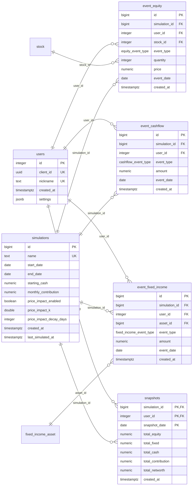
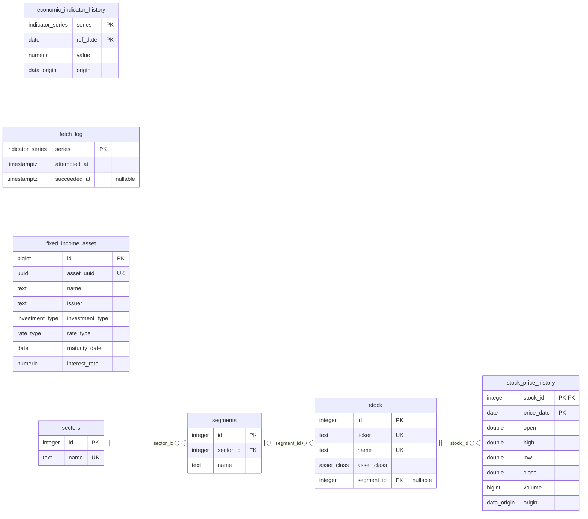

# Diagrama do Banco de Dados

O schema atual do banco, com cada tabela, suas colunas e as relações entre elas. Para a forma de alterar o schema, veja o [Ciclo de Desenvolvimento com Banco de Dados](./ciclo-banco-dados.md).

:::info Página gerada
Esta página é gerada a partir de `backend/core/models/models.py` por `pnpm db:erd`. O `tests/test_erd.py` falha enquanto ela estiver diferente dos models.
:::

**Como ler:** `PK` é chave primária, `FK` é chave estrangeira e `UK` é valor único. Uma linha liga a tabela referenciada (lado `||`, exatamente um) à que guarda a chave estrangeira (lado `o{`, zero ou mais), e o rótulo é a coluna da chave. Uma coluna marcada `nullable` aceita nulo. Coluna de `ENUM` tem como tipo o nome do `ENUM`, e os valores aceitos estão em [Valores dos ENUM](#valores-dos-enum). Uma tabela que aparece só com o nome está detalhada na outra seção.

## Partidas e jogadores

Cada partida, quem joga nela, e os eventos e snapshots que reconstroem a carteira de cada jogador.

## Ativos e indicadores

Os ativos negociáveis com o setor e o segmento de cada um, o histórico de preços e os indicadores econômicos, com a origem de cada valor (real ou gerado) e o registro das buscas.

## Valores dos ENUM

| ENUM | Valores | Colunas |
| --- | --- | --- |
| `asset_class` | `STOCK`, `FII`, `ETF`, `BDR` | `stock.asset_class` |
| `cashflow_event_type` | `DEPOSIT`, `WITHDRAW`, `DIVIDEND`, `CONTRIBUTION`, `TAX` | `event_cashflow.event_type` |
| `data_origin` | `REAL`, `GENERATED` | `economic_indicator_history.origin`, `stock_price_history.origin` |
| `equity_event_type` | `BUY`, `SELL` | `event_equity.event_type` |
| `fixed_income_event_type` | `BUY`, `REDEEM` | `event_fixed_income.event_type` |
| `indicator_series` | `CDI`, `SELIC`, `IPCA`, `IBOV` | `economic_indicator_history.series`, `fetch_log.series` |
| `investment_type` | `CDB`, `LCI`, `LCA`, `TESOURO_DIRETO` | `fixed_income_asset.investment_type` |
| `rate_type` | `SELIC`, `IPCA`, `CDI`, `PREFIXADO` | `fixed_income_asset.rate_type` |
